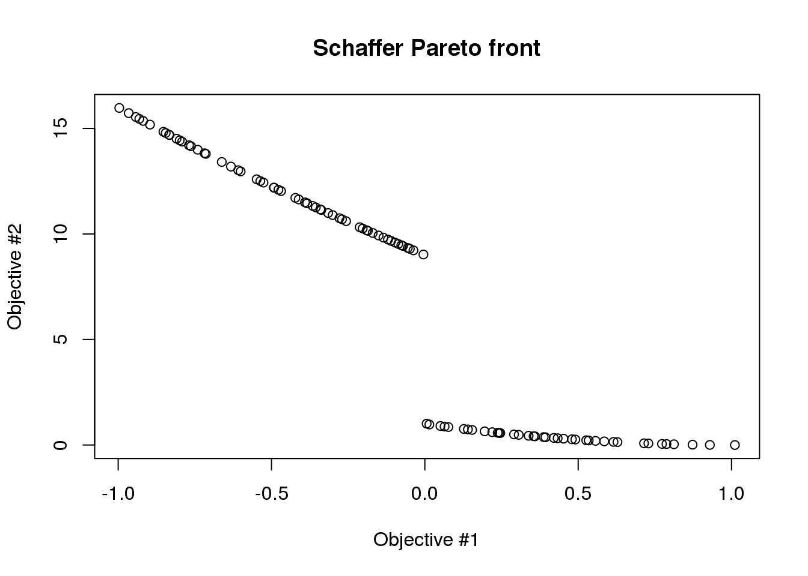

# Short Description

**caRamel** is an R package for optimization implementing a multiobjective evolutionary algorithm combining the MEAS algorithm and the NGSA-II algorithm.

# Installation
Download and install the package from [CRAN](https://cran.r-project.org/package=caRamel):

```{r caRa}
install.packages('caRamel')
```

and then load it:
```{r caRa}
library(caRamel)
```

# Test function

## Schaffer

[*Schaffer*](https://en.wikipedia.org/wiki/File:Schaffer_function_2_-_multi-objective.pdf) test function has two objectives with one variable.

<p align="center">
  
</p>
<p align="center">
   <b>Schaffer test function</b>
</p>


```{r schaffer}
schaffer <- function(i) {
  if (x[i,1] <= 1) {
    s1 <- -x[i,1]
  } else if (x[i,1] <= 3) {
    s1 <- x[i,1] - 2
  } else if (x[i,1] <= 4) {
    s1 <- 4 - x[i,1]
  } else {
    s1 <- x[i,1] - 4
  }
  s2 <- (x[i,1] - 5) * (x[i,1] - 5)
  return(c(s1, s2))
}
```

Note that :

* parameter _i_ is mandatory for the management of parallelism.
* the variable __must be named__ _x_ and is a matrix of size [npopulation, nvariables].

The variable lies in the range [-5, 10]:

```{r schaffer_variable}
nvar <- 1 # number of variables
bounds <- matrix(data = 1, nrow = nvar, ncol = 2) # upper and lower bounds
bounds[, 1] <- -5 * bounds[, 1]
bounds[, 2] <- 10 * bounds[, 2]
```

Both functions are to be minimized:

```{r schaffer_objectives}
nobj <- 2 # number of objectives
minmax <- c(FALSE, FALSE) # min and min
```

Before calling **caRamel** in order to optimize the Schaffer's problem, some algorithmic parameters need to be set:

```{r schaffer_param}
popsize <- 100 # size of the genetic population
archsize <- 100 # size of the archive for the Pareto front
maxrun <- 1000 # maximum number of calls
prec <- matrix(1.e-3, nrow = 1, ncol = nobj) # accuracy for the convergence phase
```

Then the minimization problem can be launched:

```{r schaffer_launch, fig.show="hide", results="hide"}
results <-
  caRamel(nobj,
          nvar,
          minmax,
          bounds,
          schaffer,
          popsize,
          archsize,
          maxrun,
          prec,
          carallel=FALSE) # no parallelism
```

Test if the convergence is successful:

```{r schaffer_OK}
print(results$success==TRUE)
```

Plot the Pareto front:

```{r schaffer_plot1}
plot(results$objectives[,1], results$objectives[,2], main="Schaffer Pareto front", xlab="Objective #1", ylab="Objective #2")
```

```{r schaffer_plot2}
plot(results$parameters, main="Corresponding values for X", xlab="Element of the archive", ylab="X Variable")
```

# References

* Efstratiadis, A. and Koutsoyiannis, D., _The multiobjective evolutionary annealing-simplex method and its application in calibrating hydrological models_, EGU General Assembly 2005, Geophysical Research Abstracts, vol.7, Vienna, European Geophysical Union
* Reed, P. and Devireddy, D., _Groundwater monitoring design: a case study combining epsilon-dominance archiving and automatic parameterization for the NGSA-II_, Coello-Coello C editor, Applications of multiobjective evolutionary algorithms, Advances in natural computation series, vol. 1, pp. 79-100, Word Scientific, New-York, 2004

# License
GPL v3

# Contributors

Contributions are always welcome ;-)

When contributing to **caRamel** please consider discussing the changes you wish to make via issue or e-mail to the maintainer.
